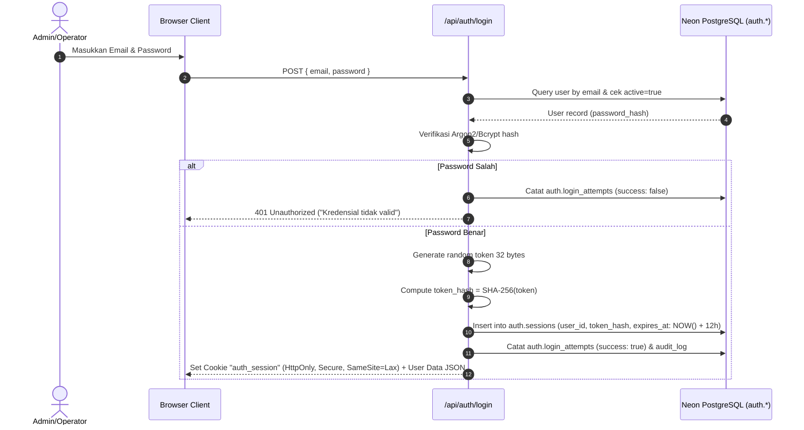
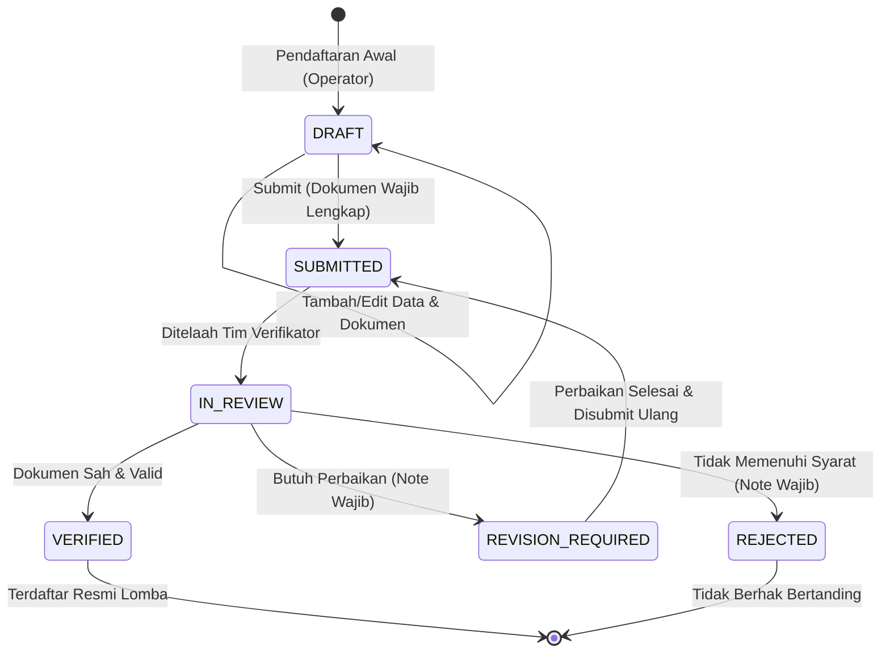

# IMPLEMENTASI TEKNIS: SISTEM PENDATAAN & VERIFIKASI PESERTA LOMBA LPTK KECAMATAN
**Versi:** 3.0 | **Stack:** Next.js (App Router) + TypeScript + Neon PostgreSQL

---

## 1. STRUKTUR PROYEK & KONVENSI ARSITEKTUR

Struktur direktori dirancang dengan pemisahan tanggung jawab yang tegas (*separation of concerns*), menempatkan logika bisnis di layer server (*repositories*, *services*, *validators*) dan menjauhkan client dari akses langsung ke database.

```text
src/
├── app/
│   ├── api/
│   │   ├── auth/
│   │   │   ├── login/route.ts
│   │   │   ├── logout/route.ts
│   │   │   ├── me/route.ts
│   │   │   └── change-password/route.ts
│   │   │
│   │   └── admin/
│   │       ├── meta/
│   │       │   ├── menu/route.ts
│   │       │   └── options/route.ts
│   │       ├── dashboard/route.ts
│   │       ├── villages/
│   │       │   ├── route.ts
│   │       │   ├── [id]/route.ts
│   │       │   └── bulk-delete/route.ts
│   │       ├── lptks/
│   │       │   ├── route.ts
│   │       │   ├── [id]/
│   │       │   │   ├── route.ts
│   │       │   │   ├── users/route.ts
│   │       │   │   └── participants/route.ts
│   │       │   └── bulk-delete/route.ts
│   │       ├── users/
│   │       │   ├── route.ts
│   │       │   ├── [id]/
│   │       │   │   ├── route.ts
│   │       │   │   ├── reset-password/route.ts
│   │       │   │   ├── activate/route.ts
│   │       │   │   └── deactivate/route.ts
│   │       │   └── bulk-delete/route.ts
│   │       ├── roles/
│   │       │   ├── route.ts
│   │       │   ├── [id]/
│   │       │   │   ├── route.ts
│   │       │   │   └── permissions/route.ts
│   │       ├── permissions/route.ts
│   │       ├── competitions/
│   │       │   ├── route.ts
│   │       │   ├── [id]/
│   │       │   │   ├── route.ts
│   │       │   │   ├── categories/route.ts
│   │       │   │   └── statistics/route.ts
│   │       │   └── bulk-delete/route.ts
│   │       ├── categories/
│   │       │   ├── route.ts
│   │       │   ├── [id]/
│   │       │   │   ├── route.ts
│   │       │   │   └── document-requirements/route.ts
│   │       │   └── bulk-delete/route.ts
│   │       ├── document-types/
│   │       │   ├── route.ts
│   │       │   ├── [id]/route.ts
│   │       │   └── bulk-delete/route.ts
│   │       ├── participants/
│   │       │   ├── route.ts
│   │       │   ├── [id]/
│   │       │   │   ├── route.ts
│   │       │   │   ├── submit/route.ts
│   │       │   │   ├── categories/
│   │       │   │   │   ├── route.ts
│   │       │   │   │   └── [categoryId]/route.ts
│   │       │   │   ├── documents/route.ts
│   │       │   │   └── verifications/route.ts
│   │       │   ├── bulk-delete/route.ts
│   │       │   └── export/route.ts
│   │       ├── documents/
│   │       │   ├── [id]/
│   │       │   │   ├── route.ts
│   │       │   │   ├── download/route.ts
│   │       │   │   └── replace/route.ts
│   │       │   └── bulk-delete/route.ts
│   │       ├── verifications/
│   │       │   ├── route.ts
│   │       │   └── history/route.ts
│   │       ├── reports/
│   │       │   ├── participants/route.ts
│   │       │   ├── lptks/route.ts
│   │       │   ├── categories/route.ts
│   │       │   ├── verification/route.ts
│   │       │   └── export/route.ts
│   │       ├── audit-logs/
│   │       │   ├── route.ts
│   │       │   └── [id]/route.ts
│   │       ├── settings/route.ts
│   │       └── cdn/route.ts
│   │
│   ├── (auth)/
│   │   └── login/page.tsx
│   │
│   └── (dashboard)/admin/
│       ├── layout.tsx
│       ├── page.tsx (Dashboard)
│       ├── villages/page.tsx (Modal CRUD)
│       ├── lptks/
│       │   ├── page.tsx
│       │   ├── new/page.tsx
│       │   └── [id]/edit/page.tsx
│       ├── users/
│       │   ├── page.tsx
│       │   ├── new/page.tsx
│       │   └── [id]/edit/page.tsx
│       ├── competitions/
│       │   ├── page.tsx
│       │   ├── new/page.tsx
│       │   └── [id]/edit/page.tsx
│       ├── participants/
│       │   ├── page.tsx
│       │   ├── new/page.tsx
│       │   ├── [id]/edit/page.tsx
│       │   └── [id]/page.tsx (Detail + Dokumen)
│       ├── verifications/
│       │   └── page.tsx
│       ├── reports/
│       │   └── page.tsx
│       ├── audit-logs/
│       │   └── page.tsx
│       └── settings/
│           └── page.tsx
│
├── server/
│   ├── db/
│   │   ├── client.ts          # Neon Connection Pool
│   │   └── schema.ts          # Drizzle / SQL Tables
│   ├── repositories/          # Raw queries / SQL Layer
│   ├── services/              # Business Logic & Transactions
│   ├── validators/            # Zod Validation Schemas
│   ├── middlewares/           # Auth guard, permission guard, rate limiter
│   └── utils/
│       ├── response.ts        # Unified JSON response builder
│       ├── pagination.ts      # Query parser (page, size, sort)
│       ├── magic-bytes.ts     # Buffer signature checker
│       └── audit.ts           # Audit log dispatcher
│
├── components/
│   ├── ui/                    # Monochrome Primitive Components (Button, Input, Modal, Table)
│   ├── layout/                # Sidebar, Header, MobileNav
│   ├── shared/                # BulkAction, PaginationBar, ViewSwitcher
│   └── modules/               # Form components per module
│
├── lib/
│   ├── constants.ts           # Status codes, Roles, Theme colors
│   ├── cdn.ts                 # GitHub/jsDelivr CDN URL resolver
│   └── formatters.ts          # Date & file size formatters
│
└── types/
    ├── api.ts                 # Standard API types
    ├── auth.ts                # Session & User types
    └── database.ts            # Entity models
```

---

## 2. SKEMA DATABASE NEON POSTGRESQL (DDL & RELASI)

Skema database dipisahkan ke dalam dua schema:
1. `auth`: Mengelola user, credential, session token, roles, dan permissions.
2. `public`: Mengelola domain bisnis perlombaan, peserta, dokumen privat, verifikasi, audit log, dan setting.

### 2.1 Schema `auth` (Database-Backed Auth)

```sql
CREATE SCHEMA IF NOT EXISTS auth;

-- 1. Roles
CREATE TABLE auth.roles (
    id UUID PRIMARY KEY DEFAULT gen_random_uuid(),
    code VARCHAR(50) UNIQUE NOT NULL,      -- SUPER_ADMIN, ADMIN_KECAMATAN, OPERATOR_LPTK
    name VARCHAR(100) NOT NULL,
    description TEXT,
    is_system BOOLEAN DEFAULT false,       -- System roles cannot be deleted
    created_at TIMESTAMPTZ DEFAULT NOW(),
    updated_at TIMESTAMPTZ DEFAULT NOW()
);

-- 2. Permissions
CREATE TABLE auth.permissions (
    id UUID PRIMARY KEY DEFAULT gen_random_uuid(),
    code VARCHAR(100) UNIQUE NOT NULL,     -- e.g. participant.read, participant.write
    group_name VARCHAR(50) NOT NULL,       -- participant, village, lptk, report, audit
    name VARCHAR(100) NOT NULL,
    description TEXT,
    created_at TIMESTAMPTZ DEFAULT NOW()
);

-- 3. Role Permissions (Pivot)
CREATE TABLE auth.role_permissions (
    role_id UUID NOT NULL REFERENCES auth.roles(id) ON DELETE CASCADE,
    permission_id UUID NOT NULL REFERENCES auth.permissions(id) ON DELETE CASCADE,
    PRIMARY KEY (role_id, permission_id)
);

-- 4. Users
CREATE TABLE auth.users (
    id UUID PRIMARY KEY DEFAULT gen_random_uuid(),
    email VARCHAR(255) UNIQUE NOT NULL,
    password_hash VARCHAR(255) NOT NULL,
    full_name VARCHAR(150) NOT NULL,
    role_id UUID NOT NULL REFERENCES auth.roles(id),
    lptk_id UUID,                          -- NULL for Super Admin & Admin Kecamatan
    active BOOLEAN DEFAULT true,
    must_change_password BOOLEAN DEFAULT false,
    last_login_at TIMESTAMPTZ,
    created_at TIMESTAMPTZ DEFAULT NOW(),
    updated_at TIMESTAMPTZ DEFAULT NOW()
);

-- 5. Sessions
CREATE TABLE auth.sessions (
    id UUID PRIMARY KEY DEFAULT gen_random_uuid(),
    user_id UUID NOT NULL REFERENCES auth.users(id) ON DELETE CASCADE,
    token_hash VARCHAR(64) UNIQUE NOT NULL,-- SHA-256 hash of token cookie
    user_agent TEXT,
    ip_address VARCHAR(45),
    expires_at TIMESTAMPTZ NOT NULL,       -- Absolute timeout (12h from creation)
    last_active_at TIMESTAMPTZ NOT NULL,   -- Idle timeout (30m)
    created_at TIMESTAMPTZ DEFAULT NOW()
);

-- 6. Login Attempts (Brute-force protection)
CREATE TABLE auth.login_attempts (
    id UUID PRIMARY KEY DEFAULT gen_random_uuid(),
    email VARCHAR(255) NOT NULL,
    ip_address VARCHAR(45) NOT NULL,
    user_agent TEXT,
    success BOOLEAN NOT NULL,
    created_at TIMESTAMPTZ DEFAULT NOW()
);

CREATE INDEX idx_sessions_token_hash ON auth.sessions(token_hash);
CREATE INDEX idx_login_attempts_email ON auth.login_attempts(email, created_at);
```

### 2.2 Schema `public` (Domain Bisnis LPTK)

```sql
-- 1. Master Desa
CREATE TABLE public.villages (
    id UUID PRIMARY KEY DEFAULT gen_random_uuid(),
    code VARCHAR(50) UNIQUE NOT NULL,
    name VARCHAR(150) NOT NULL,
    created_at TIMESTAMPTZ DEFAULT NOW(),
    updated_at TIMESTAMPTZ DEFAULT NOW(),
    deleted_at TIMESTAMPTZ
);

-- 2. Master LPTK
CREATE TABLE public.lptks (
    id UUID PRIMARY KEY DEFAULT gen_random_uuid(),
    village_id UUID NOT NULL REFERENCES public.villages(id),
    code VARCHAR(50) UNIQUE NOT NULL,
    name VARCHAR(150) NOT NULL,
    leader_name VARCHAR(150) NOT NULL,
    phone VARCHAR(30) NOT NULL,
    address TEXT NOT NULL,
    active BOOLEAN DEFAULT true,
    created_at TIMESTAMPTZ DEFAULT NOW(),
    updated_at TIMESTAMPTZ DEFAULT NOW(),
    deleted_at TIMESTAMPTZ
);

ALTER TABLE auth.users 
ADD CONSTRAINT fk_user_lptk 
FOREIGN KEY (lptk_id) REFERENCES public.lptks(id) ON DELETE SET NULL;

-- 3. Event / Lomba
CREATE TABLE public.competitions (
    id UUID PRIMARY KEY DEFAULT gen_random_uuid(),
    name VARCHAR(150) NOT NULL,
    description TEXT,
    period_year INT NOT NULL,
    status_code VARCHAR(30) NOT NULL DEFAULT 'DRAFT', -- DRAFT, OPEN, CLOSED, COMPLETED
    registration_open_at TIMESTAMPTZ NOT NULL,
    registration_close_at TIMESTAMPTZ NOT NULL,
    created_at TIMESTAMPTZ DEFAULT NOW(),
    updated_at TIMESTAMPTZ DEFAULT NOW(),
    deleted_at TIMESTAMPTZ
);

-- 4. Kategori Lomba
CREATE TABLE public.categories (
    id UUID PRIMARY KEY DEFAULT gen_random_uuid(),
    competition_id UUID NOT NULL REFERENCES public.competitions(id) ON DELETE CASCADE,
    name VARCHAR(150) NOT NULL,
    gender_code VARCHAR(20) NOT NULL,       -- MALE, FEMALE, ANY
    age_min INT NOT NULL DEFAULT 0,
    age_max INT NOT NULL DEFAULT 100,
    requirements TEXT,
    active BOOLEAN DEFAULT true,
    created_at TIMESTAMPTZ DEFAULT NOW(),
    updated_at TIMESTAMPTZ DEFAULT NOW(),
    deleted_at TIMESTAMPTZ
);

-- 5. Master Jenis Dokumen Persyaratan
CREATE TABLE public.document_types (
    id UUID PRIMARY KEY DEFAULT gen_random_uuid(),
    code VARCHAR(50) UNIQUE NOT NULL,      -- KTP, KK, PAS_FOTO, SURAT_MANDAT, AKTA
    name VARCHAR(150) NOT NULL,
    is_required BOOLEAN DEFAULT true,
    active BOOLEAN DEFAULT true,
    created_at TIMESTAMPTZ DEFAULT NOW(),
    updated_at TIMESTAMPTZ DEFAULT NOW(),
    deleted_at TIMESTAMPTZ
);

-- 6. Dokumen Wajib per Kategori
CREATE TABLE public.category_document_requirements (
    category_id UUID NOT NULL REFERENCES public.categories(id) ON DELETE CASCADE,
    document_type_id UUID NOT NULL REFERENCES public.document_types(id) ON DELETE CASCADE,
    is_mandatory BOOLEAN DEFAULT true,
    PRIMARY KEY (category_id, document_type_id)
);

-- 7. Peserta Lomba (Core Entity)
CREATE TABLE public.participants (
    id UUID PRIMARY KEY DEFAULT gen_random_uuid(),
    competition_id UUID NOT NULL REFERENCES public.competitions(id),
    lptk_id UUID NOT NULL REFERENCES public.lptks(id),
    name VARCHAR(150) NOT NULL,
    nik VARCHAR(16) NOT NULL,
    gender_code VARCHAR(20) NOT NULL,       -- MALE, FEMALE
    birth_place VARCHAR(100) NOT NULL,
    birth_date DATE NOT NULL,
    address TEXT NOT NULL,
    phone VARCHAR(30) NOT NULL,
    school_or_institution VARCHAR(150),
    father_name VARCHAR(150),
    mother_name VARCHAR(150),
    status_code VARCHAR(30) NOT NULL DEFAULT 'DRAFT', -- DRAFT, SUBMITTED, IN_REVIEW, VERIFIED, REVISION_REQUIRED, REJECTED
    rejection_note TEXT,
    created_by UUID REFERENCES auth.users(id),
    submitted_at TIMESTAMPTZ,
    created_at TIMESTAMPTZ DEFAULT NOW(),
    updated_at TIMESTAMPTZ DEFAULT NOW(),
    deleted_at TIMESTAMPTZ,
    CONSTRAINT uq_competition_nik UNIQUE (competition_id, nik)
);

-- 8. Relasi Peserta & Kategori
CREATE TABLE public.participant_categories (
    participant_id UUID NOT NULL REFERENCES public.participants(id) ON DELETE CASCADE,
    category_id UUID NOT NULL REFERENCES public.categories(id) ON DELETE RESTRICT,
    PRIMARY KEY (participant_id, category_id)
);

-- 9. Dokumen Privat Peserta
CREATE TABLE public.participant_documents (
    id UUID PRIMARY KEY DEFAULT gen_random_uuid(),
    participant_id UUID NOT NULL REFERENCES public.participants(id) ON DELETE CASCADE,
    document_type_id UUID NOT NULL REFERENCES public.document_types(id),
    file_name VARCHAR(255) NOT NULL,
    mime_type VARCHAR(100) NOT NULL,
    file_size_bytes BIGINT NOT NULL,
    sha256_hash VARCHAR(64) NOT NULL,
    file_data BYTEA,                        -- Neon storage for private bytes (or internal pointer)
    status_code VARCHAR(30) DEFAULT 'VALID', -- VALID, REJECTED
    created_at TIMESTAMPTZ DEFAULT NOW(),
    updated_at TIMESTAMPTZ DEFAULT NOW()
);

-- 10. Riwayat & Keputusan Verifikasi
CREATE TABLE public.verifications (
    id UUID PRIMARY KEY DEFAULT gen_random_uuid(),
    participant_id UUID NOT NULL REFERENCES public.participants(id) ON DELETE CASCADE,
    verifier_id UUID NOT NULL REFERENCES auth.users(id),
    decision VARCHAR(30) NOT NULL,         -- VERIFIED, REVISION_REQUIRED, REJECTED, IN_REVIEW
    note TEXT,
    created_at TIMESTAMPTZ DEFAULT NOW()
);

-- 11. Audit Log Sistem
CREATE TABLE public.audit_logs (
    id UUID PRIMARY KEY DEFAULT gen_random_uuid(),
    user_id UUID REFERENCES auth.users(id) ON DELETE SET NULL,
    action_code VARCHAR(100) NOT NULL,     -- LOGIN, CREATE_PARTICIPANT, VERIFY_PARTICIPANT, etc.
    entity_type VARCHAR(50) NOT NULL,      -- participant, user, lptk, document, etc.
    entity_id VARCHAR(100),
    ip_address VARCHAR(45),
    user_agent TEXT,
    old_data JSONB,
    new_data JSONB,
    created_at TIMESTAMPTZ DEFAULT NOW()
);

-- 12. Pengaturan Sistem
CREATE TABLE public.system_settings (
    key VARCHAR(100) PRIMARY KEY,
    value JSONB NOT NULL,
    description TEXT,
    updated_by UUID REFERENCES auth.users(id),
    updated_at TIMESTAMPTZ DEFAULT NOW()
);

CREATE INDEX idx_participants_status ON public.participants(status_code);
CREATE INDEX idx_participants_lptk ON public.participants(lptk_id);
CREATE INDEX idx_participants_comp ON public.participants(competition_id);
CREATE INDEX idx_audit_logs_created_at ON public.audit_logs(created_at DESC);
CREATE INDEX idx_audit_logs_action ON public.audit_logs(action_code);
```

---

## 3. MEKANISME AUTHENTICATION & SESSION ENGINE

Sistem otentikasi didesain dengan ketahanan stateful berbasis database:

### 3.1 Alur Login & Pembuatan Session


### 3.2 Aturan Validasi Session
Pada setiap request ke `/api/admin/*`:
1. Ambil cookie `auth_session`. Jika tidak ada -> return `401 Unauthorized`.
2. Hash cookie tersebut dengan SHA-256 -> bandingkan dengan `auth.sessions.token_hash`.
3. Verifikasi waktu:
   - `NOW() > expires_at` (Absolute timeout 12 jam tercapai) -> Hapus session, return `401`.
   - `NOW() - last_active_at > 30 MINUTES` (Idle timeout 30 menit tercapai) -> Hapus session, return `401`.
4. Jika valid, update `last_active_at = NOW()` di database.
5. Injeksi context user (`id`, `role_code`, `lptk_id`, `permissions[]`) ke server request context.

---

## 4. STANDARISASI API & KONTRAK DATA

### 4.1 Response Wrapper Helper (`src/server/utils/response.ts`)

```typescript
export function successResponse<T>(data: T, meta?: Record<string, any>, status = 200) {
  return Response.json(
    {
      success: true,
      data,
      ...(meta ? { meta } : {}),
    },
    { status }
  );
}

export function errorResponse(code: string, message: string, status = 400) {
  return Response.json(
    {
      success: false,
      error: {
        code,
        message,
      },
    },
    { status }
  );
}
```

### 4.2 Query Formatter & Pagination Helper (`src/server/utils/pagination.ts`)

```typescript
export interface ListQueryParams {
  page: number;
  pageSize: number;
  q?: string;
  sort: string;
  order: 'asc' | 'desc';
}

export function parseListQueryParams(searchParams: URLSearchParams): ListQueryParams {
  const page = Math.max(1, parseInt(searchParams.get('page') || '1', 10));
  const pageSize = Math.min(100, Math.max(1, parseInt(searchParams.get('page_size') || '20', 10)));
  const q = searchParams.get('q')?.trim() || undefined;
  const sort = searchParams.get('sort') || 'created_at';
  const order = searchParams.get('order')?.toLowerCase() === 'asc' ? 'asc' : 'desc';

  return { page, pageSize, q, sort, order };
}
```

### 4.3 Bulk Delete Standard Execution

```typescript
// Input: { ids: string[] }
// Output: { success: true, data: { deleted: number, failed: Array<{ id: string, reason: string }> } }
```

Setiap handler bulk delete menjalankan pengecekan referensi foreign key. Id yang tidak dapat dihapus dikumpulkan dalam array `failed` dengan alasan error yang jelas (misal: `DATA_REFERENCED`), sedangkan yang berhasil dihapus tetap diproses tanpa membatalkan seluruh operasi secara sepihak jika tidak dalam mode transactional strict.

---

## 5. VALIDASI DOKUMEN & KEAMANAN STORAGE PRIVAT

Dokumen peserta (KTP, KK, Surat Mandat, Foto) adalah arsip pribadi yang dilarang disebarkan ke publik CDN.

### 5.1 Validasi Magic Bytes (Buffer Inspection)
MIME type dari header client tidak dapat dipercaya karena mudah dipalsukan. Validasi dilakukan pada byte awal file:

```typescript
export function validateMagicBytes(buffer: Buffer): { valid: boolean; detectedMime?: string } {
  // PDF: %PDF- (25 50 44 46)
  if (buffer.length >= 4 && buffer[0] === 0x25 && buffer[1] === 0x50 && buffer[2] === 0x44 && buffer[3] === 0x46) {
    return { valid: true, detectedMime: 'application/pdf' };
  }
  // JPEG: FF D8 FF
  if (buffer.length >= 3 && buffer[0] === 0xff && buffer[1] === 0xd8 && buffer[2] === 0xff) {
    return { valid: true, detectedMime: 'image/jpeg' };
  }
  // PNG: 89 50 4E 47 0D 0A 1A 0A
  if (
    buffer.length >= 8 &&
    buffer[0] === 0x89 && buffer[1] === 0x50 && buffer[2] === 0x4e && buffer[3] === 0x47 &&
    buffer[4] === 0x0d && buffer[5] === 0x0a && buffer[6] === 0x1a && buffer[7] === 0x0a
  ) {
    return { valid: true, detectedMime: 'image/png' };
  }

  return { valid: false };
}
```

### 5.2 Stream Download Aman
Endpoint `GET /api/admin/documents/:id/download`:
1. Cek hak akses user (Super Admin, Verifikator, atau Operator pemilik dokumen).
2. Catat audit log: `DOWNLOAD_DOCUMENT`.
3. Set response header:
   ```http
   Content-Type: application/pdf (atau image/jpeg)
   Content-Disposition: attachment; filename="KTP_Ahmad_320101.pdf"
   Cache-Control: private, no-cache, no-store, must-revalidate
   ```

---

## 6. SIKLUS HIDUP STATUS PESERTA (STATE MACHINE)



Aturan Hak Akses Berdasarkan Status:
- **DRAFT**: Operator LPTK bebas mengedit data dan mengganti dokumen.
- **SUBMITTED & IN_REVIEW**: Data terkunci dari editan Operator LPTK. Hanya Verifikator yang dapat memproses.
- **REVISION_REQUIRED**: Kunci dibuka sebagian khusus untuk memperbarui data/dokumen yang ditandai catatan revisi.
- **VERIFIED**: Terkunci permanen untuk Operator. Hanya Super Admin yang dapat merevisi jika ada insiden luar biasa.

---

## 7. MONOCHROME DESIGN SYSTEM & UI GUIDELINES

Sesuai ketentuan PRD v3.0:
- **Warna Pokok**:
  - Background Utama: Putih (`#FFFFFF`) & Grayscale Light (`#FAFAFA`, `#F4F4F5`)
  - Permukaan/Kartu: `#FFFFFF` dengan border tipis `#E4E4E7`
  - Teks Utama: Hitam (`#09090B`)
  - Teks Sekunder: Abu netral (`#71717A`)
  - Aksen/Highlight: Hitam Solid (`#18181B`) atau Invert Putih di atas Hitam
  - **Dilarang Warna Neon** (tidak ada neon blue, lime, purple glow, dsb.)
- **Tombol (Maksimal 1 Kata)**:
  - `Masuk`, `Keluar`, `Simpan`, `Batal`, `Hapus`, `Kirim`, `Unduh`, `Filter`, `Ubah`, `Tolak`, `Terima`, `Revisi`.
- **Menu Sidebar (Maksimal 1 Kata)**:
  - `Dashboard`, `Desa`, `LPTK`, `Pengguna`, `Peran`, `Lomba`, `Kategori`, `Dokumen`, `Peserta`, `Verifikasi`, `Laporan`, `Audit`, `Pengaturan`.
- **Ikon**:
  - Menggunakan library `lucide-react` (SVG gratis, clean, monochrome).
- **Aturan Modal vs Halaman**:
  - Form <= 3 field (e.g. Master Desa, Jenis Dokumen) -> Gunakan Modal Dialog bersih.
  - Form > 3 field (e.g. Master LPTK, Pendaftaran Peserta, Pengguna, Lomba) -> Wajib Dedicated Page terpisah.
- **Tampilan Tabel**:
  - Ringkas dan jelas; kolom deskripsi panjang ditiadakan atau dipersingkat maksimal 30 karakter.
  - Menyediakan toggle tombol `List` dan `Grid`.
