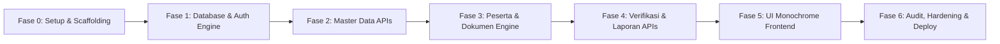

# MASTER PLAN: SISTEM PENDATAAN & VERIFIKASI PESERTA LOMBA LPTK KECAMATAN
**Versi:** 3.0 | **Pendekatan:** Backend-First Monolith (Next.js + Neon PostgreSQL + Monochrome UI)

---

## 1. RINGKASAN EKSEKUTIF

Sistem Pendataan dan Verifikasi Peserta Lomba LPTK Kecamatan adalah platform web terpadu untuk mendata, mengelola, mengunggah dokumen persyaratan, dan memverifikasi peserta lomba LPTK di tingkat kecamatan.

Dokumen ini menjabarkan tahapan eksekusi teknis yang berpegang teguh pada prinsip **Backend-First**, **Keamanan Data (Database-Backed Auth & Scoped Permissions)**, dan **UI Monokrom Hitam-Putih yang Fungsional & Bersih**.

---

## 2. PRINSIP DASAR & BATASAN KETAT (LOCKED CONSTRAINTS)

Berdasarkan PRD v3.0, keputusan berikut dikunci dan menjadi acuan mutlak:

1. **Monolith Next.js (App Router + Route Handlers)**: Backend dan Frontend berada dalam 1 repository.
2. **Backend-First**: Seluruh API dan schema database diselesaikan dan divalidasi sebelum membangun UI frontend.
3. **No Direct DB from Client**: Browser dilarang menyentuh database secara langsung; semua via API internal (`/api/admin/*` dan `/api/auth/*`).
4. **Neon PostgreSQL Auth**: Session, user, role, permission disimpan dan divalidasi langsung di database (bukan JWT stateless tanpa kontrol session).
5. **Private Document Isolation**: File privat peserta disimpan dengan aman di database/storage privat internal, dilarang disebarkan ke GitHub CDN publik.
6. **Strict Monochrome UI**: 
   - Warna hanya Hitam (#000000), Putih (#FFFFFF), dan shades netral abu-abu grayscale (#F4F4F5, #E4E4E7, #18181B).
   - Dilarang warna neon (cyan, lime, hot pink, dsb.).
   - Tombol maksimal 1 kata (e.g., `Simpan`, `Hapus`, `Batal`, `Kirim`, `Filter`).
   - Item Sidebar maksimal 1 kata (e.g., `Dashboard`, `Desa`, `LPTK`, `Pengguna`, `Lomba`, `Kategori`, `Peserta`, `Verifikasi`, `Laporan`, `Audit`, `Pengaturan`).
   - Tidak ada deskripsi panjang bertele-tele pada list view.
7. **Form Rules**:
   - Create dan Edit memakai komponen form yang sama.
   - Form <= 3 field (seperti Master Desa) boleh Modal dialog.
   - Form > 3 field (LPTK, Peserta, Lomba, Pengguna) wajib Dedicated Page (`/admin/[module]/new`, `/admin/[module]/[id]/edit`).
8. **List Standards**:
   - Pagination default 20 items.
   - Fitur List View dan Grid View toggle.
   - Bulk Delete (hapus massal) wajib ada di semua modul CRUD utama.

---

## 3. TIMELINE & FASE IMPLEMENTASI

---

### FASE 0: SETUP & INISIALISASI PROYEK
**Target:** Lingkungan kerja Next.js TypeScript siap dengan standard linter, formatter, dan dependencies.

- [ ] Inisialisasi Next.js 14/15 App Router dengan TypeScript dan Tailwind CSS.
- [ ] Konfigurasi Tailwind CSS untuk pure monochrome palette (Black, White, Zinc/Neutral shades).
- [ ] Instalasi dependencies utama:
  - Database: `@neondatabase/serverless` atau `pg` (Postgres driver) + `drizzle-orm` / raw SQL query builder.
  - Validasi: `zod` untuk request/schema validation.
  - Keamanan: `argon2` atau `bcryptjs` untuk password hashing, `nanoid` / `crypto` untuk token session.
  - UI Icons: `lucide-react` (SVG library gratis berbobot ringan).
- [ ] Konfigurasi struktur folder standar sesuai PRD Section 4.
- [ ] Konfigurasi environment variables (`.env.example`).

---

### FASE 1: ARSITEKTUR DATABASE & AUTHENTICATION ENGINE (BACKEND CORE)
**Target:** Skema database PostgreSQL di Neon siap, sistem otentikasi session-based dan permission guard berjalan 100%.

- [ ] Desain DDL PostgreSQL dengan schema `auth` dan `public`:
  - `auth.roles`, `auth.permissions`, `auth.role_permissions`
  - `auth.users`, `auth.sessions`, `auth.login_attempts`
- [ ] Script migrasi dan seeder awal:
  - Default roles: `SUPER_ADMIN`, `ADMIN_KECAMATAN`, `OPERATOR_LPTK`.
  - Default permissions (30+ atomic permissions).
  - Akun Super Admin bawaan.
- [ ] Implementasi Session Engine:
  - Token generator (kriptografis 32+ bytes) disimpan dalam bentuk SHA-256 hash di database.
  - Cookie HttpOnly, Secure, SameSite=Lax/Strict.
  - Absolute timeout (12 jam) dan Idle timeout (30 menit).
- [ ] Route Handlers Otentikasi:
  - `POST /api/auth/login` (dengan rate limit & login attempt logging)
  - `POST /api/auth/logout` (menghapus session di database & membersihkan cookie)
  - `GET /api/auth/me` (profil user aktif + permissions list)
  - `POST /api/auth/change-password`
- [ ] Auth & Permission Middleware / Guard:
  - Helper `requireAuth(req)` dan `requirePermission(req, 'permission.code')`.
  - Scoped Context Helper (`user.lptk_id` untuk isolasi data Operator LPTK).

---

### FASE 2: API MASTER DATA & PENDUKUNG (CRUD & OPTIONS)
**Target:** Endpoint API untuk master desa, LPTK, user, role, lomba, kategori, dan jenis dokumen.

- [ ] Standard Response & Query Formatter:
  - Pagination, sorting (`sort`, `order`), search (`q`).
  - Standard bulk delete handler.
- [ ] Master Desa (`/api/admin/villages`):
  - CRUD + Bulk Delete + Foreign key protection (pencegahan hapus desa yang berelasi dengan LPTK).
- [ ] Master LPTK (`/api/admin/lptks`):
  - CRUD + Bulk Delete + User list per LPTK + Participant list per LPTK.
- [ ] User Management (`/api/admin/users`):
  - CRUD + Reset password + Toggle active/inactive + Bulk Delete.
- [ ] Role & Permission (`/api/admin/roles`, `/api/admin/permissions`):
  - List role & assign permissions. Proteksi role sistem agar tidak bisa dihapus.
- [ ] Event / Lomba (`/api/admin/competitions`):
  - CRUD + Bulk Delete + Kategori relasi + Statistik pendaftar lomba.
- [ ] Kategori Lomba (`/api/admin/categories`):
  - CRUD + Dokumen persyaratan wajib per kategori + Filter per lomba.
- [ ] Jenis Dokumen (`/api/admin/document-types`):
  - CRUD jenis dokumen persyaratan (e.g. KTP, KK, Pas Foto, Ijazah/Surat Mandat).
- [ ] Meta & Options API:
  - `GET /api/admin/meta/menu` (Dynamic menu items disaring berdasarkan permission user).
  - `GET /api/admin/meta/options` (Master dropdown cacheable: desa, LPTK, lomba, kategori, status).

---

### FASE 3: MODUL INTI — PESERTA & DOKUMEN PERSYARATAN
**Target:** Pendaftaran peserta lengkap, upload dokumen dengan validasi ketat, dan submit workflow.

- [ ] Schema Database Peserta & Dokumen:
  - `public.participants` (identitas, NIK unik per kompetisi, LPTK scoping, status).
  - `public.participant_categories` (kategori lomba yang diikuti).
  - `public.participant_documents` (metadata file, MIME, bytea/storage link, checksum SHA-256).
- [ ] Validasi Bisnis Peserta:
  - Validasi NIK 16 digit & cek duplikasi.
  - Role scoping: `OPERATOR_LPTK` hanya dapat memanipulasi peserta milik LPTK-nya.
  - State machine check: Edit hanya diizinkan pada status `DRAFT` atau `REVISION_REQUIRED`.
- [ ] Endpoint Peserta (`/api/admin/participants`):
  - List with advanced filters (q, competition_id, lptk_id, village_id, category_id, status_code).
  - Create / Read / Update / Delete / Bulk Delete.
  - Submit endpoint (`POST /api/admin/participants/:id/submit`) dengan pengecekan kelengkapan dokumen wajib.
- [ ] Secure Document Management (`/api/admin/documents`):
  - Upload via `POST /api/admin/participants/:id/documents`.
  - Validasi Magic Bytes (PDF, JPG, PNG) mencegah spoofing file ekstensi.
  - Perhitungan hash SHA-256 untuk integritas data.
  - Endpoint unduh aman (`GET /api/admin/documents/:id/download`) dengan audit logging dan token authorization.

---

### FASE 4: VERIFIKASI, LAPORAN & AUDIT LOGGING
**Target:** Antrean verifikator kecamatan, riwayat keputusan, rekapitulasi data, dan audit trail komprehensif.

- [ ] Modul Verifikasi (`/api/admin/verifications`):
  - Antrean pendaftar berstatus `SUBMITTED` dan `IN_REVIEW`.
  - Eksekusi keputusan (`POST /api/admin/participants/:id/verification`):
    - `VERIFIED`
    - `REVISION_REQUIRED` (wajib note/alasan perbaikan)
    - `REJECTED` (wajib note/alasan penolakan)
    - `IN_REVIEW`
  - Riwayat verifikasi lengkap per peserta.
- [ ] Audit Log Engine (`/api/admin/audit-logs`):
  - Trigger/Middleware pencatat otomatis setiap mutasi data (CREATE, UPDATE, DELETE, BULK_DELETE, VERIFY, LOGIN, dsb.).
  - Detail data lama (old value) dan data baru (new value) dalam format JSON.
  - Filter pencarian audit log berdasarkan user, rentang tanggal, jenis aksi, dan entitas.
- [ ] Laporan & Rekapitulasi (`/api/admin/reports`):
  - Rekap per desa/LPTK.
  - Rekap per cabang lomba & kategori.
  - Rekap status verifikasi.
  - Export data ke format CSV yang terformat rapi sesuai filter aktif.
- [ ] Dashboard API (`/api/admin/dashboard`):
  - Agregasi metrik total peserta, terverifikasi, butuh revisi, ditolak, dan kapasitas dokumen.

---

### FASE 5: FRONTEND ADMIN PANEL MONOKROM (MOBILE-FIRST)
**Target:** Antarmuka Next.js yang bersih, berstandar industri, hitam-putih murni, tanpa warna neon, sangat responsif.

- [ ] Layout & Navigasi Monokrom:
  - Dynamic Sidebar (nama item maksimal 1 kata, fetch dari `/api/admin/meta/menu`).
  - Mobile bottom bar / hamburger drawer untuk akses handphone.
  - Header minimalis dengan info user aktif dan tombol `Keluar`.
- [ ] Desain Komponen Standar (Monochrome Design System):
  - Button standar (Maksimal 1 kata: `Simpan`, `Batal`, `Hapus`, `Kirim`, `Unduh`).
  - Data Table & Grid Card dengan toggle switcher.
  - Pagination bar (20 baris per halaman, nomor halaman, limit).
  - Bulk action toolbar (terbuka saat checkbox baris dipilih).
  - Modal Form (2-3 field untuk Desa, Jenis Dokumen).
  - Full Page Form (LPTK, Peserta, Pengguna, Lomba).
  - Status Badge monokromatis (Kombinasi outline, solid hitam, solid putih, dan grayscale).
- [ ] Halaman Utama:
  - `/login`: Form masuk minimalis hitam-putih.
  - `/admin`: Dashboard ringkasan angka & grafik statistik batang grayscale.
  - `/admin/villages`: List + Modal CRUD Desa.
  - `/admin/lptks`: List + Form Halaman LPTK.
  - `/admin/users`: List + Form Halaman Pengguna + Reset Password.
  - `/admin/competitions`: List + Form Halaman Lomba + Kategori.
  - `/admin/participants`: List/Grid + Filter Drawer + Halaman Form Peserta.
  - `/admin/participants/[id]`: Detail Peserta + Viewer Dokumen + Status Tracker.
  - `/admin/verifications`: Meja kerja verifikator (Side-by-side data & dokumen + form keputusan).
  - `/admin/reports`: Halaman filter & tombol `Export`.
  - `/admin/audit-logs`: Tabel jejak riwayat aktivitas sistem.
  - `/admin/settings`: Pengaturan batas upload, ekstensi diizinkan, dan periode lomba.

---

### FASE 6: AUDIT KEAMANAN, VERIFIKASI AKHIR & DEPLOYMENT
**Target:** Uji coba end-to-end, validasi constraint PRD, dan deployment siap pakai di Vercel + Neon.

- [ ] Security Hardening:
  - Sanitasi input dan proteksi terhadap SQL Injection (parameterized queries).
  - Cek ulang penegakan RBAC di setiap route handler.
  - Proteksi IDOR (Insecure Direct Object References) pada unduh dokumen dan edit peserta antar-LPTK.
- [ ] UI/UX Compliance Check:
  - Verifikasi: tidak ada tombol > 1 kata.
  - Verifikasi: tidak ada menu sidebar > 1 kata.
  - Verifikasi: tidak ada warna neon / aksen mencolok selain hitam, putih, dan abu-abu.
  - Verifikasi: responsivitas tampilan di layar mobile (360px - 414px) dan desktop.
- [ ] Setup Script Database & GitHub Deployment:
  - Konfigurasi migrasi otomatis di Vercel build step.
  - Setup aset logo / empty state di GitHub CDN / jsDelivr.

---

## 4. MATRIKS ROLES & AKSES FITUR

| Modul | Super Admin | Admin Kecamatan | Operator LPTK |
|---|:---:|:---:|:---:|
| **Dashboard** | Read All | Read All | Read (Scoped LPTK) |
| **Master Desa** | Full CRUD | Read Only | No Access |
| **Master LPTK** | Full CRUD | Read & Edit | Read Own LPTK |
| **Pengguna** | Full CRUD | Read & Reset Operator | No Access |
| **Role & Permission** | Full CRUD | No Access | No Access |
| **Lomba & Kategori** | Full CRUD | Full CRUD | Read Only |
| **Peserta** | Full Access | Full Access | Create/Edit/Submit Own LPTK |
| **Dokumen** | Full Access | View & Download | Upload/Delete Own Draft |
| **Verifikasi** | Decide All | Decide All | View Decision & Note Only |
| **Laporan & Export** | Full Export | Full Export | Export Own LPTK |
| **Audit Logs** | View All | View All | No Access |
| **Pengaturan** | Full CRUD | Read Only | No Access |

---

## 5. KRITERIA PENERIMAAN (ACCEPTANCE CRITERIA)

1. **Backend First:** Seluruh route handler pada `/api/admin/*` dan `/api/auth/*` dapat diuji via automated testing atau HTTP client sebelum frontend digunakan.
2. **Kepatuhan Form & Tampilan:**
   - Form Desa menggunakan Modal (2 field).
   - Form Peserta, LPTK, Lomba, User menggunakan Dedicated Page (> 3 field).
   - Seluruh button berlabel 1 kata.
   - Seluruh menu sidebar berlabel 1 kata.
   - Tidak ada elemen warna neon di seluruh aplikasi.
3. **Integritas Dokumen:**
   - File privat diverifikasi magic bytes (bukan hanya MIME header client).
   - File tidak bocor ke publik CDN.
   - Dokumen hanya dapat diakses oleh pihak berwenang via endpoint resmi.
4. **Reliabilitas Sesi:**
   - Sesi terdaftar di DB; jika user logout atau dideaktivasi, sesi otomatis gugur seketika.
